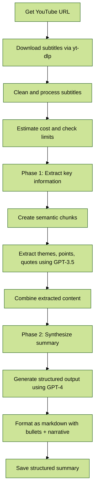

# TL;DW (Too Long; Didn't Watch)

Summarize YouTube videos using OpenAI's ChatGPT with intelligent two-phase processing for high-quality, structured summaries.

```
USAGE:

Usage: tldw [OPTIONS] --video-url <VIDEO_URL>

Options:
  -v, --video-url <VIDEO_URL>
  -e, --engine <ENGINE>        [default: 4]
  -p, --prompt <PROMPT>        [default: 0]
  -h, --help                   Print help
  -V, --version                Print version

```

### Requirements
- An environment variable named `OPENAI_API_KEY` must be defined, containing an [OpenAI API secret key](https://platform.openai.com/account/api-keys).
- [yt-dlp](https://github.com/yt-dlp/yt-dlp) must be installed and available in your system's PATH.

### Features
- **Two-Phase Processing**: Uses Map-Reduce pattern for better context preservation
- **Structured Output**: Generates both bullet points and narrative summaries
- **Cost-Efficient**: Smart model selection (GPT-3.5 for extraction, GPT-4 for synthesis)
- **Cost Control**: Built-in cost estimation and optional spending limits
- **Semantic Chunking**: Intelligent content splitting that preserves meaning
- **Quality Focus**: Prioritizes summary quality over real-time streaming

### Limitations

- Videos without subtitles cannot be processed.
- The quality of summaries based on auto-generated subtitles may vary.
- Results default to English, even if the input language is different.
- Processing time is longer than simple chunking (but produces much better results).
- Requires sufficient OpenAI API quota for two-phase processing.


### Architecture: Two-Phase Processing



### Output Format

The tool generates structured summaries with:

```markdown
# Video Title

## Key Themes
- **Theme 1**: Brief description
- **Theme 2**: Brief description

## Detailed Points
### Theme 1
- Key point 1
- Key point 2

### Theme 2
- Key point 1
- Key point 2

## Narrative Summary
[Coherent narrative connecting all themes with logical flow]

## Key Quotes & Insights
- "Important quote 1"
- "Important quote 2"
```

### Cost Management

- **Smart Model Selection**: Uses GPT-3.5-turbo for extraction (cheaper) and GPT-4 for synthesis (better quality)
- **Cost Estimation**: Shows estimated cost before processing
- **Spending Limits**: Built-in $5 default limit (configurable)
- **Linear Scaling**: Cost scales linearly with content size, not exponentially

