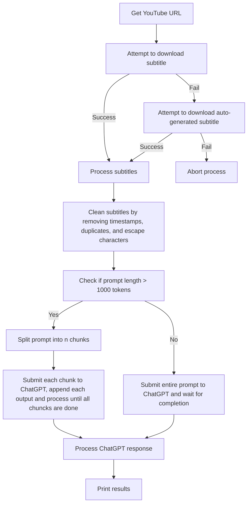

# TL;DW (Too Long; Didn't Watch)


Summarize YouTube videos using ChatGPT.

```
USAGE:

Usage: tldw [OPTIONS] --video-url <VIDEO_URL>

Options:
  -v, --video-url <VIDEO_URL>
  -e, --engine <ENGINE>        [default: 4]
  -p, --prompt <PROMPT>        [default: 0]
  -h, --help                   Print help
  -V, --version                Print version

```

### Requirements
- An environment variable named `OPENAI_API_KEY` must be defined, containing an [OpenAI API secret key](ttps://platform.openai.com/account/api-keys).
- [yt-dlp](https://github.com/yt-dlp/yt-dlp) must be installed and available in your system's PATH.

### Limitations

- Due to API restrictions, you may exhaust your token limit before receiving a complete summary.
- Videos without subtitles cannot be processed.
- The quality of summaries based on auto-generated subtitles may vary.
- Results default to English, even if the input language is different.


### Overview 



